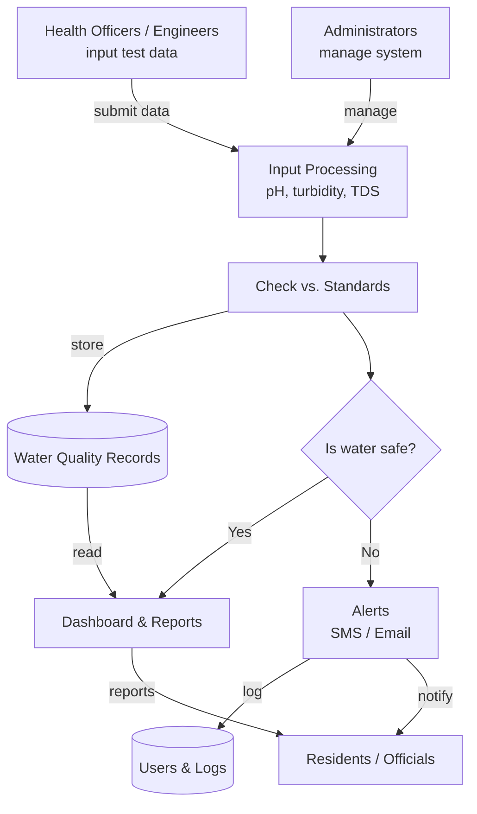

# 💧 HydroPulse

**Community Water Quality Monitoring and Management System**

HydroPulse is a web-based platform that centralizes and digitizes water quality data from communal wells and local water stations. It automatically evaluates test results against safety standards, alerts authorities when water is unsafe, and gives residents a public portal to check the latest safety status of their water sources.


---

## 📖 Table of Contents

- [Overview](#-overview)
- [Problem Statement](#-problem-statement)
- [Objectives](#-objectives)
- [Features](#-features)
- [Target Users](#-target-users)
- [System Architecture](#-system-architecture)
- [Tech Stack](#-tech-stack)
- [Getting Started](#-getting-started)
- [Project Structure](#-project-structure)
- [Scope and Limitations](#-scope-and-limitations)
- [Roadmap](#-roadmap)
- [Team](#-team)
- [Contributing](#-contributing)
- [License](#-license)

---

## 🌍 Overview

Many rural and off-grid communities depend on communal wells and local water stations for drinking water. Testing results are often recorded on paper forms or spreadsheets, which leads to fragmented data, hard-to-track trends, and delayed responses to contamination.

HydroPulse replaces this with a single system for recording, monitoring, and analyzing water quality, supporting:

- **SDG 6** – Clean Water and Sanitation
- **SDG 3** – Good Health and Well-Being

## ❗ Problem Statement

- Water quality data is recorded manually and stored in scattered files.
- Historical trends and recurring contamination are difficult to identify.
- Unsafe conditions can go unnoticed until health problems appear.
- LGUs and health officers lack a centralized view to respond quickly.
- Residents have no easy way to know whether their water source is safe.

## 🎯 Objectives

**General:** Design and develop a web-based system that centralizes water quality monitoring, improves data accessibility, and enhances public awareness of water safety.

**Specific:**

1. Record and manage water quality test results
2. Automatically evaluate water quality against safety standards
3. Provide real-time monitoring through dashboards and analytics
4. Alert stakeholders when unsafe water conditions are detected
5. Generate reports for monitoring and compliance
6. Provide a public portal for community access to water safety information

## ✨ Features

| Module | Description |
| --- | --- |
| **Water Quality Records Management** | Encode, update, and manage test results (pH, turbidity, TDS) |
| **Water Source Management** | Maintain data about wells, stations, and their locations |
| **Dashboard & Analytics** | View trends, graphs, and current water status |
| **Automated Alerts & Notifications** | Send email/SMS alerts when unsafe levels are detected |
| **Report Generation** | Produce summaries and printable reports |
| **User & Role Management** | Control access and permissions per role |
| **Public Safety Portal** | Let residents check the safety status of local water sources |

### Why HydroPulse?

- ✅ Real-time evaluation of water safety
- ✅ Automated alerts for faster response
- ✅ Historical trend analysis for preventive action
- ✅ Public transparency through accessible data

## 👥 Target Users

| Role | What they do |
| --- | --- |
| **Residents** | View water safety status and advisories through the public portal |
| **Sanitation Engineers** | Input and manage water testing data |
| **Health Officers / LGU Officials** | Monitor water quality trends and respond to issues |
| **System Administrators** | Manage users, permissions, and system configuration |

## 🏗️ System Architecture

HydroPulse follows a three-layer architecture:

- **Presentation Layer** – Browser-based UI for administrators, staff, and residents.
- **Application Layer** – Business logic: data processing, safety evaluation, and notifications.
- **Data Layer** – Centralized database for water quality records, user data, and system logs.

### Data Flow



## 🛠️ Tech Stack

| Layer | Technology |
| --- | --- |
| Frontend | HTML, CSS, JavaScript, Bootstrap |
| Backend | PHP **or** Python (Django / Flask) |
| Database | MySQL |
| Visualization | Chart.js |
| Notifications | Email / SMS integration APIs |
| Hosting | Free or low-cost hosting services |

> **Note:** Update the Backend row to reflect the framework your team finalizes.

## 🚀 Getting Started

### Prerequisites

- A web server environment (e.g., XAMPP/Apache for PHP, or Python 3.10+ for Django/Flask)
- MySQL 8.0+
- Git

### Installation

```bash
# 1. Clone the repository
git clone https://github.com/jmnzpat/hydropulse.git
cd hydropulse

# 2. Create the database
mysql -u root -p -e "CREATE DATABASE hydropulse;"

# 3. Import the schema (adjust the path to match your repo)
mysql -u root -p hydropulse < database/schema.sql
```

#### If using PHP

1. Copy the project folder into your web server root (e.g., `htdocs/` in XAMPP).
2. Copy `config.example.php` to `config.php` and set your database credentials.
3. Open `http://localhost/hydropulse` in your browser.

#### If using Python (Django/Flask)

```bash
python -m venv venv
source venv/bin/activate        # On Windows: venv\Scripts\activate
pip install -r requirements.txt
cp .env.example .env            # then edit with your DB and API credentials
python manage.py migrate        # Django
python manage.py runserver      # Django (or `flask run` for Flask)
```

### Configuration

Set the following (via `.env` or config file):

| Variable | Purpose |
| --- | --- |
| `DB_HOST`, `DB_NAME`, `DB_USER`, `DB_PASS` | MySQL connection |
| `MAIL_*` | Email notification settings |
| `SMS_API_KEY` | SMS provider credentials |

## 📁 Project Structure

> Adjust to match your actual layout.

```
hydropulse/
├── database/          # SQL schema and seed data
├── public/            # Public safety portal
├── admin/             # Dashboard, records, sources, users, reports
├── assets/            # CSS, JS, images
├── includes/          # Shared logic: evaluation, alerts, auth
├── docs/              # Proposal and documentation
└── README.md
```

## 📏 Scope and Limitations

**In scope**

- Water quality monitoring and data management
- Automated safety evaluation
- Alerts and notifications
- Public information portal
- Reporting and analytics

**Out of scope (possible future work)**

- IoT-based automatic sensor integration
- Mobile-native application
- Integration with national databases
- Advanced AI-based predictions

## 🗺️ Roadmap

- [ ] User authentication and role-based access
- [ ] Water source management
- [ ] Water quality record entry and storage
- [ ] Automated safety evaluation (pH, turbidity, TDS)
- [ ] Dashboard and analytics
- [ ] Email/SMS alert system
- [ ] Report generation
- [ ] Public safety portal
- [ ] Testing and deployment

## 👨‍💻 Team

- **John Patrick S. Jimenez**
- **Christopher Quizon**
- **Wency Castillo**

## 🤝 Contributing

Contributions, issues, and feature requests are welcome. To contribute:

1. Fork the repository
2. Create a feature branch (`git checkout -b feature/your-feature`)
3. Commit your changes (`git commit -m "Add your feature"`)
4. Push to the branch (`git push origin feature/your-feature`)
5. Open a Pull Request

